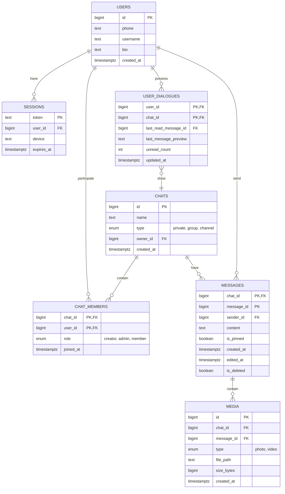

# Проектирование высоконагруженных систем. Telegram

# 1. Тема, целевая аудитория и функционал

## 1.1 Тема и целевая аудитория

**Telegram** — мессенджер для мгновенного обмена сообщениями с поддержкой личных и групповых чатов. Сервис ориентирован на скорость, безопасность и конфиденциальность при передаче сообщений между пользователями.

**Monthly Active Users**: ~1 млрд [1]. 

**Daily Active Users**: ~450 млн [1].

**Дополнительная информация**: в среднем пользователь открывает Telegram 21 раз в день и проводит в приложении 41 минуту [2].

**Демография**: 56.8% пользователей Telegram - мужчины, 43.2% - женщины. 53.5% пользователей имеют возраст от 18 до 34 лет [3].

**География**: Глобальный рынок [4].

Топ 5 стран, где больше всего используют Telegram:

| Страна | Количество пользователей, млн |
|--------|-------------------------------|
| Индия | 83.85 |
| Россия | 35.06 |
| США | 29.92 |
| Индонезия | 24.34 |
| Бразилия | 22.83 |

## 1.2 Функционал MVP

Основной функционал заключается в обеспечении обмена сообщениями между пользователями.

1. Отправка сообщений;
2. Чтение сообщений в чатах;
3. Список чатов;
4. Cоздание групп и участие в них;
5. Cоздание каналов и чтение постов;
6. Отправка и получение медиаконтента (фото, видео);
7. Поиск сообщений в чате.

## 1.3 Ключевые продуктовые решения

1. **Облачное хранение сообщений** позволяет синхронизировать историю переписки между всеми устройствами пользователя и восстанавливать историю при переустановке приложения.
2. **Синхронизация состояния** чатов и сообщений между всеми активными сессиями пользователя на разных устройствах.
3. **MTProto протокол** — собственный протокол передачи данных, оптимизированный для мобильных сетей с высокой эффективностью использования трафика и низкой задержкой.

# 2. Расчёт нагрузки

## 2.1 Продуктовые метрики

Для расчетов используются показатели аудитории из п.1, а также статистические данные об активности пользователей из открытых источников.

### Сводная таблица продуктовых метрик

| Метрика | Значение | Источник |
| :--- | :--- | :--- |
| **Monthly Active Users (MAU)** | 1 млрд | [1] |
| **Daily Active Users (DAU)** | 450 млн | [1] |
| **Среднее кол-во сообщений (отправка)** | 30 в день | [5] |
| **Среднее кол-во сообщений (чтение)** | 100 в день | [6] |
| **Средний размер сообщения (текст)** | 100 байт | см. обоснование метрик |
| **Средний размер фото** | 200 Кбайт | см. обоснование метрик |
| **Средний размер видео** | 10 Мбайт | см. обоснование метрик |
| **Среднее количество сессий (открытий)** | 21 раз в день | [2] |
| **Срок хранения истории** | Бессрочно (расчет на 1 год) | [1] |

### Обоснование метрик
* **Текст (100 байт):** Средний размер сообщения с учетом метаданных протокола MTProto и основного тела объекта `Message`.
* **Фото (200 Кбайт):** Оптимальный размер изображения для приложений.
* **Видео (10 Мбайт):** Средний размер видеосообщения (кружочка, небольшого видео) при битрейте ~2,5 Мбит/с.

## 2.2 Технические метрики

### Расчёт объёма хранения
Расчёт производится для хранения данных, генерируемых за **1 год** использования сервиса.

| Тип данных | Формула расчёта для 1 пользователя | Общий объём данных |
| :--- | :--- | :--- |
| **Текстовые сообщения** | 30 сообщ. × 365 д. × 100 байт ≈ 1,1 Мбайт | **495 Тбайт** |
| **Фото** | 10 ед. × 365 д. × 200 Кбайт ≈ 0,73 Гбайт | **329 Пбайт** |
| **Видео** | 1 ед. × 365 д. × 10 Мбайт ≈ 3,65 Гбайт | **1,64 Эбайт** |
| **Итого** | **~4,4 Гбайт** | **~2 Эбайт** |

### Сетевой трафик
При расчёте используется коэффициент суточной неравномерности *k* = 2 для определения пиковой нагрузки.

| Тип трафика | Суточный объём (Тбайт/сут) | Средний трафик (Гбит/с) | Пиковый трафик (*k*=2) (Гбит/с) |
| :--- | :--- | :--- | :--- |
| **Текстовые данные** | 450 млн × 130 зап. × 100 байт ≈ 5,8 | 0,55 | 1,1 |
| **Фото** | 450 млн × 10 ед. × 200 Кбайт ≈ 900 | 85 | 170 |
| **Видео** | 450 млн × 1 ед. × 10 МБ ≈ 4 500 | 427 | 853 |
| **Итого** | **~5 406** | **~513** | **~1024** |

### Расчёт RPS (Requests Per Second)
RPS рассчитывается по формуле: **RPS = (DAU × Действия в сутки) / 86 400**.

| Тип запроса | Общее кол-во запросов в сутки | Средний RPS | Пиковый RPS (*k*=2) |
| :--- | :--- | :--- | :--- |
| **Отправка сообщений** | 450 млн × 30 сообщ. = 13,5 млрд | 156 250 | 312 500 |
| **Синхронизация** | 450 млн × 21 сессия = 9,45 млрд | 109 375 | 218 750 |
| **Загрузка медиа** | 450 млн × (10 фото + 1 видео) = 4,95 млрд | 57 292 | 114 584 |
| **Поиск по сообщениям** | 450 млн × 5 поисков = 2,25 млрд | 26 041 | 52 082 |
| **Итого** | **30,15 млрд** | **~348 958** | **~697 916** |

# 3. Глобальная балансировка нагрузки

## 3.1 Функциональное разбиение по доменам

Для оптимизации обработки разнородных запросов и независимого масштабирования сервисов используются следующие домены:

| Доменное имя | Назначение |
| --- | --- |
| **`api.telegram.org`** | Основное API (обмен сообщениями, синхронизация, поиск) |
| **`media.telegram.org`** | Передача "тяжёлого" контента (фото, видео) |
| **`static.telegram.org`** | Раздача статических ресурсов |

## 3.2 Расположение дата-центров

| ID | Локация [8] | Обслуживаемый регион |
| --- | --- | --- |
| **DC1, DC3** | **Майами (США)** | Северная и Южная Америка |
| **DC2, DC4** | **Амстердам (Нидерланды)** | Европа, Африка |
| **DC5** | **Сингапур (Сингапур)** | Азия и Океания |

**Обоснование выбора:**

* **Амстердам:** крупнейшая точка обмена трафиком. Обеспечивает кратчайший путь до пользователей из РФ и Европы.
* **Сингапур:** ключевой узел в Азиатско-Тихоокеанском регионе. Исключает задержки при передаче данных через океан для пользователей из Индии.
* **Майами:** оптимальная точка входа в Северную и Южную Америку.

**Логика размещения данных:**

* **Каждый из 5 дата-центров** имеет свою базу данных для хранения данных тех пользователей, которые к нему привязаны.
* **Личные сообщения** хранятся в «родном» ДЦ каждого участника диалога. Синхронизация между регионами происходит через внутреннее межсерверное взаимодействие.
* **Группы и каналы** привязываются к одному ДЦ («родной» ДЦ создателя) для обеспечения строгой последовательности сообщений для всех участников.

## 3.3 Распределение запросов по ДЦ

Нагрузка распределяется пропорционально активной аудитории регионов, исходя из рассчитанного пикового RPS **697 916** (п. 2.2).

| Регион (ДЦ) | Процент трафика | Пиковый RPS | Обоснование |
| --- | --- | --- | --- |
| **Азия (DC5)** | 40% | ~279 166 | Крупнейший регион (Индия) |
| **Европа (DC2, DC4)** | 35% | ~244 271 | РФ, СНГ и Европа |
| **Америка (DC1, DC3)** | 25% | ~174 479 | США и Бразилия |
| **Итого** | **100%** | **697 916** |  |

## 3.4 Схема балансировки

Для минимизации задержек при перемещении пользователей используется двухуровневая схема балансировки.

**1 уровень (Geo-based DNS)**

| Домен | Что отправляется/запрашивается | Куда направляется |
| --- | --- | --- |
| **`api.telegram.org`** | Запросы API: отправка/получение сообщений, синхронизация, список чатов, поиск | IP одного из 5 DC по геолокации (Азия - DC5, Европа/РФ - DC2/DC4, Америки - DC1/DC3) |
| **`media.telegram.org`** | Загрузка и скачивание фото, видео | IP одного из 5 DC по геолокации (Азия - DC5, Европа/РФ - DC2/DC4, Америки - DC1/DC3) |
| **`static.telegram.org`** | Запросы статики (JS, CSS) | IP одного из 5 DC по геолокации (Азия - DC5, Европа/РФ - DC2/DC4, Америки - DC1/DC3) |

**2 уровень (внутреннее проксирование)**

При нахождении пользователя вне «родного» региона (командировка, туризм) используется трехуровневый алгоритм обработки запроса:

* **Идентификация:** ближайший к пользователю ДЦ принимает соединение и определяет User_ID.
* **Поиск:** по локальной реплике реестра пользователей определяется ID «родного» ДЦ пользователя, где физически хранятся его данные.
* **Туннелирование:** запрос проксируется в целевой ДЦ по внутренним магистральным каналам Telegram.

**Примечание:** если пользователь находится в «чужом» регионе длительное время, система инициирует фоновый перенос данных из старого ДЦ в новый ближайший ДЦ (**User Migration**).

## 3.5 Механизмы регулировки трафика

1. **Weighted Round-Robin:** использование весовых коэффициентов для управления долями входящего трафика (для DC1 и DC3, для DC2 и DC4).
2. **Active Health Checks:** мониторинг состояния ДЦ. При деградации сервиса ДЦ автоматически выводится из DNS-выдачи.

# 4. Локальная балансировка нагрузки

## 4.1 Схема балансировки

Внутри дата-центра реализована двухуровневая схема балансировки:

**L4-балансировщик:**

| Параметр | Описание |
| --- | --- |
| **Реализация** | LVS (Linux Virtual Server) |
| **Режим работы** | Virtual Server via Direct Routing. Входящий трафик распределяется между узлами L7, а исходящий трафик идёт напрямую к клиенту, что минимизирует нагрузку на балансировщик. |
| **Резервирование** | Схема N × 2. Keepalived обеспечивает автоматическое переключение Virtual IP на резервный узел при отказе основного. |

**L7-балансировщик:**

| Параметр | Описание |
| --- | --- |
| **Реализация** | Кластер серверов nginx (Reverse Proxy) |
| **Функции** | SSL Termination, распределение запросов по микросервисам |
| **Оптимизация** | Session tickets для ускорения повторных TLS-соединений |
| **Резервирование** | Схема N + 1 |

## 4.2 Расчёт количества балансировщиков

Расчёт выполнен для наиболее загруженного дата-центра (DC5 — Азия) в «худшем» случае:

* **Пиковый трафик:** 410 Гбит/с  
* **Пиковая нагрузка:** 279 166 RPS  

### 1. Расчёт узлов L4

Целевая конфигурация — серверы с сетевыми интерфейсами 100GbE. Ограничитель — пропускная способность канала.

**Расчёт активных узлов:**

410 Гбит/с ÷ 100 Гбит/с = 4,1 → 5 серверов

С учётом резервирования (N × 2): на каждую активную ноду нужен резерв.

**Итого:** 10 серверов.

### 2. Расчёт узлов L7

Конфигурация узлов: 16 CPU, NIC 100GbE. Учитываются два ограничителя: пропускная способность и SSL Termination.

**По пропускной способности:**

410 Гбит/с ÷ 100 Гбит/с = 4,1 → 5 серверов

**По SSL Termination:**

Интенсивность новых TLS-соединений принята равной общему RPS:

279 166 RPS = 279 166 CPS

При производительности одного сервера 6 676 CPS [9]:

279 166 CPS ÷ 6 676 CPS ≈ 41,8 → 42 сервера

42 > 5, выбираем «худший» случай — 42. С учётом резервирования (N + 1) — 43 сервера.

**Итого:** 43 сервера. 

## 4.3 Итоговая конфигурация оборудования

| Уровень | Количество | Конфигурация узла | Тип резервирования |
| --- | --- | --- | --- |
| **L4** | 10 | CPU 8 Cores, NIC 100GbE | N × 2 |
| **L7** | 43 | CPU 16 Cores, NIC 100GbE | N + 1 |

# 5. Логическая схема БД

## 5.1 Схема БД

## 5.2 Таблица с описанием таблиц

| Таблица | Описание | Размер строки | Количество строк | Размер таблицы | Нагрузка на запись (QPS, пик) | Нагрузка на чтение (QPS, пик) |
| :--- | :--- | :--- | :--- | :--- | :--- | :--- |
| **`users`** | Профили пользователей | id(8) + phone(20) + username(32) + bio(70) + created_at(8) ≈ 138 Б | 1 млрд | ≈ 138 ГБ | 92 | 175 000 |
| **`sessions`** | Сессии пользователей | token(64) + user_id(8) + device(50) + expires_at(8) ≈ 130 Б | 2 млрд | ≈ 260 ГБ | 8 646 | 209 374 |
| **`chats`** | Чаты (диалоги, группы, каналы) | id(8) + name(50) + type(1) + owner_id(8) + created_at(8) ≈ 75 Б | 5 млрд | ≈ 375 ГБ | 11 574 | 175 000 |
| **`chat_members`** | Связь пользователей и чатов | chat_id(8) + user_id(8) + role(1) + joined_at(8) ≈ 25 Б | 50 млрд | ≈ 1,25 ТБ | 115 740 | 468 750 |
| **`user_dialogues`** | Список чатов пользователя | user_id(8) + chat_id(8) + last_read_message_id(8) + last_message_preview(100) + unread_count(4) + updated_at(8) ≈ 136 Б | 50 млрд | ≈ 6,8 ТБ | 312 500 | 218 750 |
| **`messages`** | Сообщения | chat_id(8) + message_id(8) + sender_id(8) + content(100) + is_pinned(1) + created_at(8) + edited_at(8) + is_deleted(1) ≈ 142 Б | 4,9 трлн | ≈ 695 ТБ | 312 500 | 1 041 666 |
| **`media`** | Медиафайлы | id(8) + chat_id(8) + message_id(8) + type(1) + file_path(100) + size_bytes(8) + created_at(8) ≈ 141 Б | 1,8 трлн | ≈ 254 ТБ | 114 584 | 143 228 |

**Примечание:** количество строк в таблицах messages (4,9 трлн) и media (1,8 трлн) получено из расчётов суточного объёма сообщений и медиафайлов в п. 2.2. Нагрузка на запись для этих таблиц соответствует пиковым значениям RPS из п. 2.2: 312 500 для отправки сообщений и 114 584 для загрузки медиа. Нагрузка на чтение и запись для остальных таблиц выведена аналогично с учётом логики работы системы.

Требования к консистентности:

* Strict Consistency: `chats`, `chat_members` (состав и роли участников чата должны быть строго согласованы), `messages` (порядок сообщений должен соблюдаться для корректного отображения истории всем участникам).

* Eventual Consistency: `users`, `sessions`, `media`, `user_dialogues` (допустима небольшая задержка при обновлении списка чатов, загрузки медиафайлов и т.п.).

Особенности распределения нагрузки:

* `messages`, `chats` и `chat_members` шардируются по `chat_id`. Это обеспечивает хранение данных, связанных с конкретным чатом, в одном месте, что позволяет эффективно проверять права участников.
* `users`, `sessions` и `user_dialogues` шардируются по `user_id`. Это позволяет равномерно распределить нагрузку от операций с профилями, сессиями и загрузкой главного экрана (списка чатов) пользователя без необходимости собирать данные с разных шардов.

## Список источников

1. https://telegram.org/press
2. https://t.me/durov/404
3. https://www.demandsage.com/telegram-statistics/
4. https://worldpopulationreview.com/country-rankings/telegram-users-by-country
5. https://telegram.org/blog/15-billion
6. https://ads.telegram.org
7. https://core.telegram.org/api/datacenter
8. https://telegramplayground.github.io/pyrogram/faq/what-are-the-ip-addresses-of-telegram-data-centers.html#id1
9. https://blog.nginx.org/blog/testing-the-performance-of-nginx-and-nginx-plus-web-servers
