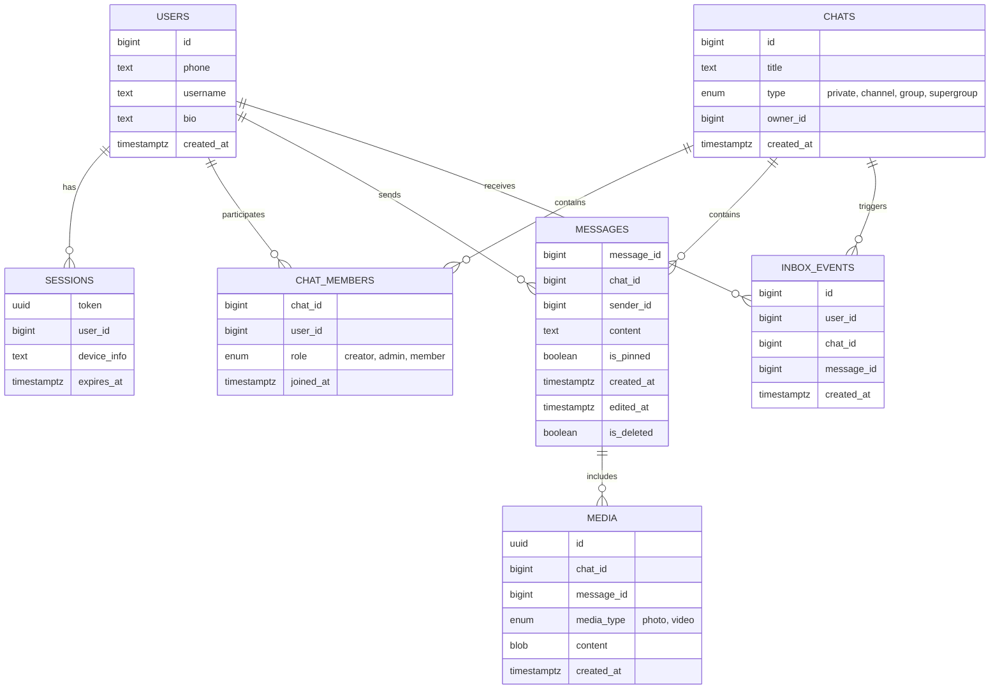
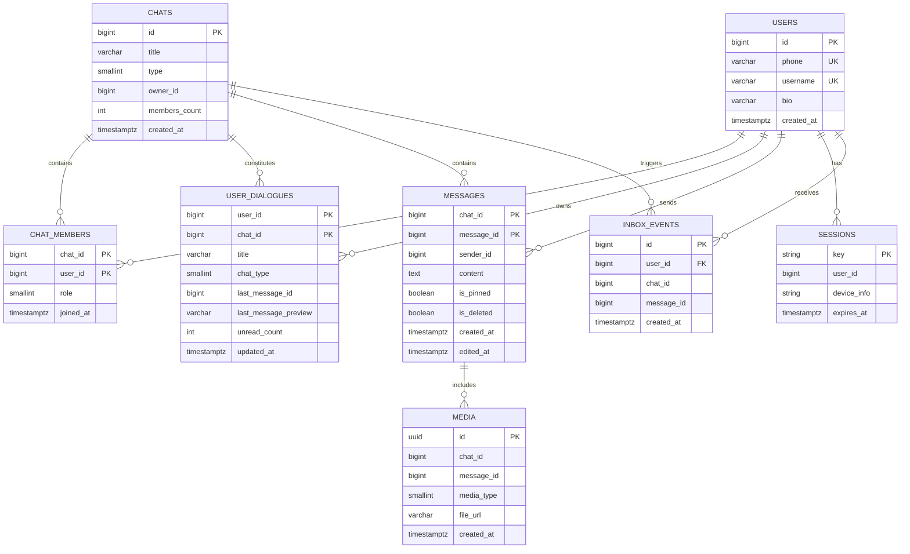

# Проектирование высоконагруженных систем. Telegram

# 1. Тема, целевая аудитория и функционал

## 1.1 Тема и целевая аудитория

**Telegram** — мессенджер для мгновенного обмена сообщениями с поддержкой личных и групповых чатов. Сервис ориентирован на скорость, безопасность и конфиденциальность при передаче сообщений между пользователями.

**Monthly Active Users**: ~1 млрд [1]. 

**Daily Active Users**: ~450 млн [1].

**Дополнительная информация**: в среднем пользователь открывает Telegram 21 раз в день и проводит в приложении 41 минуту [2].

**Демография**: 56.8% пользователей Telegram - мужчины, 43.2% - женщины. 53.5% пользователей имеют возраст от 18 до 34 лет [3].

**География**: Глобальный рынок [4].

Топ 5 стран, где больше всего используют Telegram:

| Страна | Количество пользователей, млн |
|--------|-------------------------------|
| Индия | 83.85 |
| Россия | 35.06 |
| США | 29.92 |
| Индонезия | 24.34 |
| Бразилия | 22.83 |

## 1.2 Функционал MVP

Основной функционал заключается в обеспечении обмена сообщениями между пользователями.

1. Отправка сообщений;
2. Чтение сообщений в чатах;
3. Список чатов;
4. Cоздание групп и участие в них;
5. Cоздание каналов и чтение постов;
6. Отправка и получение медиаконтента (фото, видео);
7. Поиск сообщений в чате.

## 1.3 Ключевые продуктовые решения

1. **Облачное хранение сообщений** позволяет синхронизировать историю переписки между всеми устройствами пользователя и восстанавливать историю при переустановке приложения.
2. **Синхронизация состояния** чатов и сообщений между всеми активными сессиями пользователя на разных устройствах.
3. **MTProto протокол** — собственный протокол передачи данных, оптимизированный для мобильных сетей с высокой эффективностью использования трафика и низкой задержкой.

# 2. Расчёт нагрузки

## 2.1 Продуктовые метрики

Для расчетов используются показатели аудитории из п.1, а также статистические данные об активности пользователей из открытых источников.

### Сводная таблица продуктовых метрик

| Метрика | Значение | Источник |
| :--- | :--- | :--- |
| **Monthly Active Users (MAU)** | 1 млрд | [1] |
| **Daily Active Users (DAU)** | 450 млн | [1] |
| **Среднее кол-во сообщений (отправка)** | 30 в день | [5] |
| **Среднее кол-во сообщений (чтение)** | 100 в день | [6] |
| **Средний размер сообщения (текст)** | 100 байт | см. обоснование метрик |
| **Средний размер фото** | 200 Кбайт | см. обоснование метрик |
| **Средний размер видео** | 10 Мбайт | см. обоснование метрик |
| **Среднее количество сессий (открытий)** | 21 раз в день | [2] |
| **Срок хранения истории** | Бессрочно (расчет на 1 год) | [1] |

### Обоснование метрик
* **Текст (100 байт):** Средний размер сообщения с учетом метаданных протокола MTProto и основного тела объекта `Message`.
* **Фото (200 Кбайт):** Оптимальный размер изображения для приложений.
* **Видео (10 Мбайт):** Средний размер видеосообщения (кружочка, небольшого видео) при битрейте ~2,5 Мбит/с.

## 2.2 Технические метрики

### Расчёт объёма хранения
Расчёт производится для хранения данных, генерируемых за **1 год** использования сервиса.

| Тип данных | Формула расчёта для 1 пользователя | Общий объём данных |
| :--- | :--- | :--- |
| **Текстовые сообщения** | 30 сообщ. × 365 д. × 100 байт ≈ 1,1 Мбайт | **495 Тбайт** |
| **Фото** | 10 ед. × 365 д. × 200 Кбайт ≈ 0,73 Гбайт | **329 Пбайт** |
| **Видео** | 1 ед. × 365 д. × 10 Мбайт ≈ 3,65 Гбайт | **1,64 Эбайт** |
| **Итого** | **~4,4 Гбайт** | **~2 Эбайт** |

### Сетевой трафик
При расчёте используется коэффициент суточной неравномерности *k* = 2 для определения пиковой нагрузки.

| Тип трафика | Суточный объём (Тбайт/сут) | Средний трафик (Гбит/с) | Пиковый трафик (*k*=2) (Гбит/с) |
| :--- | :--- | :--- | :--- |
| **Текстовые данные** | 450 млн × 130 зап. × 100 байт ≈ 5,8 | 0,55 | 1,1 |
| **Фото** | 450 млн × 10 ед. × 200 Кбайт ≈ 900 | 85 | 170 |
| **Видео** | 450 млн × 1 ед. × 10 МБ ≈ 4 500 | 427 | 853 |
| **Итого** | **~5 406** | **~513** | **~1024** |

### Расчёт RPS (Requests Per Second)
RPS рассчитывается по формуле: **RPS = (DAU × Действия в сутки) / 86 400**.

| Тип запроса | Общее кол-во запросов в сутки | Средний RPS | Пиковый RPS (*k*=2) |
| :--- | :--- | :--- | :--- |
| **Отправка сообщений** | 450 млн × 30 сообщ. = 13,5 млрд | 156 250 | 312 500 |
| **Синхронизация** | 450 млн × 21 сессия = 9,45 млрд | 109 375 | 218 750 |
| **Загрузка медиа** | 450 млн × (10 фото + 1 видео) = 4,95 млрд | 57 292 | 114 584 |
| **Поиск по сообщениям** | 450 млн × 5 поисков = 2,25 млрд | 26 041 | 52 082 |
| **Итого** | **30,15 млрд** | **~348 958** | **~697 916** |

# 3. Глобальная балансировка нагрузки

## 3.1 Функциональное разбиение по доменам

Для оптимизации обработки разнородных запросов и независимого масштабирования сервисов используются следующие домены:

| Доменное имя | Назначение |
| --- | --- |
| **`api.telegram.org`** | Основное API (обмен сообщениями, синхронизация, поиск) |
| **`media.telegram.org`** | Передача "тяжёлого" контента (фото, видео) |
| **`static.telegram.org`** | Раздача статических ресурсов |

## 3.2 Расположение дата-центров

| ID | Локация [8] | Обслуживаемый регион |
| --- | --- | --- |
| **DC1, DC3** | **Майами (США)** | Северная и Южная Америка |
| **DC2, DC4** | **Амстердам (Нидерланды)** | Европа, Африка |
| **DC5** | **Сингапур (Сингапур)** | Азия и Океания |

**Обоснование выбора:**

* **Амстердам:** крупнейшая точка обмена трафиком. Обеспечивает кратчайший путь до пользователей из РФ и Европы.
* **Сингапур:** ключевой узел в Азиатско-Тихоокеанском регионе. Исключает задержки при передаче данных через океан для пользователей из Индии.
* **Майами:** оптимальная точка входа в Северную и Южную Америку.

**Логика размещения данных:**

* **Каждый из 5 дата-центров** имеет свою базу данных для хранения данных тех пользователей, которые к нему привязаны.
* **Личные сообщения** хранятся в «родном» ДЦ каждого участника диалога. Синхронизация между регионами происходит через внутреннее межсерверное взаимодействие.
* **Группы и каналы** привязываются к одному ДЦ («родной» ДЦ создателя) для обеспечения строгой последовательности сообщений для всех участников.

## 3.3 Распределение запросов по ДЦ

Нагрузка распределяется пропорционально активной аудитории регионов, исходя из рассчитанного пикового RPS **697 916** (п. 2.2).

| Регион (ДЦ) | Процент трафика | Пиковый RPS | Обоснование |
| --- | --- | --- | --- |
| **Азия (DC5)** | 40% | ~279 166 | Крупнейший регион (Индия) |
| **Европа (DC2, DC4)** | 35% | ~244 271 | РФ, СНГ и Европа |
| **Америка (DC1, DC3)** | 25% | ~174 479 | США и Бразилия |
| **Итого** | **100%** | **697 916** |  |

## 3.4 Схема балансировки

Для минимизации задержек при перемещении пользователей используется двухуровневая схема балансировки.

**1 уровень (Geo-based DNS)**

| Домен | Что отправляется/запрашивается | Куда направляется |
| --- | --- | --- |
| **`api.telegram.org`** | Запросы API: отправка/получение сообщений, синхронизация, список чатов, поиск | IP одного из 5 DC по геолокации (Азия - DC5, Европа/РФ - DC2/DC4, Америки - DC1/DC3) |
| **`media.telegram.org`** | Загрузка и скачивание фото, видео | IP одного из 5 DC по геолокации (Азия - DC5, Европа/РФ - DC2/DC4, Америки - DC1/DC3) |
| **`static.telegram.org`** | Запросы статики (JS, CSS) | IP одного из 5 DC по геолокации (Азия - DC5, Европа/РФ - DC2/DC4, Америки - DC1/DC3) |

**2 уровень (внутреннее проксирование)**

При нахождении пользователя вне «родного» региона (командировка, туризм) используется трехуровневый алгоритм обработки запроса:

* **Идентификация:** ближайший к пользователю ДЦ принимает соединение и определяет User_ID.
* **Поиск:** по локальной реплике реестра пользователей определяется ID «родного» ДЦ пользователя, где физически хранятся его данные.
* **Туннелирование:** запрос проксируется в целевой ДЦ по внутренним магистральным каналам Telegram.

**Примечание:** если пользователь находится в «чужом» регионе длительное время, система инициирует фоновый перенос данных из старого ДЦ в новый ближайший ДЦ (**User Migration**).

## 3.5 Механизмы регулировки трафика

1. **Weighted Round-Robin:** использование весовых коэффициентов для управления долями входящего трафика (для DC1 и DC3, для DC2 и DC4).
2. **Active Health Checks:** мониторинг состояния ДЦ. При деградации сервиса ДЦ автоматически выводится из DNS-выдачи.

# 4. Локальная балансировка нагрузки

## 4.1 Схема балансировки

Внутри дата-центра реализована двухуровневая схема балансировки:

**L4-балансировщик:**

| Параметр | Описание |
| --- | --- |
| **Реализация** | LVS (Linux Virtual Server) |
| **Режим работы** | Virtual Server via Direct Routing. Входящий трафик распределяется между узлами L7, а исходящий трафик идёт напрямую к клиенту, что минимизирует нагрузку на балансировщик. |
| **Резервирование** | Схема N × 2. Keepalived обеспечивает автоматическое переключение Virtual IP на резервный узел при отказе основного. |

**L7-балансировщик:**

| Параметр | Описание |
| --- | --- |
| **Реализация** | Кластер серверов nginx (Reverse Proxy) |
| **Функции** | SSL Termination, распределение запросов по микросервисам |
| **Оптимизация** | Session tickets для ускорения повторных TLS-соединений |
| **Резервирование** | Схема N + 1 |

## 4.2 Расчёт количества балансировщиков

Расчёт выполнен для наиболее загруженного дата-центра (DC5 — Азия) в «худшем» случае:

* **Пиковый трафик:** 410 Гбит/с  
* **Пиковая нагрузка:** 279 166 RPS  

### 1. Расчёт узлов L4

Целевая конфигурация — серверы с сетевыми интерфейсами 100GbE. Ограничитель — пропускная способность канала.

**Расчёт активных узлов:**

410 Гбит/с ÷ 100 Гбит/с = 4,1 → 5 серверов

С учётом резервирования (N × 2): на каждую активную ноду нужен резерв.

**Итого:** 10 серверов.

### 2. Расчёт узлов L7

Конфигурация узлов: 16 CPU, NIC 100GbE. Учитываются два ограничителя: пропускная способность и SSL Termination.

**По пропускной способности:**

410 Гбит/с ÷ 100 Гбит/с = 4,1 → 5 серверов

**По SSL Termination:**

Интенсивность новых TLS-соединений принята равной общему RPS:

279 166 RPS = 279 166 CPS

При производительности одного сервера 6 676 CPS [9]:

279 166 CPS ÷ 6 676 CPS ≈ 41,8 → 42 сервера

42 > 5, выбираем «худший» случай — 42. С учётом резервирования (N + 1) — 43 сервера.

**Итого:** 43 сервера. 

## 4.3 Итоговая конфигурация оборудования

| Уровень | Количество | Конфигурация узла | Тип резервирования |
| --- | --- | --- | --- |
| **L4** | 10 | CPU 8 Cores, NIC 100GbE | N × 2 |
| **L7** | 43 | CPU 16 Cores, NIC 100GbE | N + 1 |

# 5. Логическая схема БД

## 5.1 Схема БД

## 5.2 Таблица с описанием таблиц

| Таблица | Описание | Размер строки | Количество строк | Размер таблицы | Нагрузка на запись (QPS, пик) | Нагрузка на чтение (QPS, пик) |
| :--- | :--- | :--- | :--- | :--- | :--- | :--- |
| **`users`** | Профили пользователей | id(8) + phone(20) + username(32) + bio(70) + created_at(8) ≈ 138 Б | 2,7 млрд | 373 ГБ | 58 | 175 000 |
| **`sessions`** | Сессии пользователей | token(16) + user_id(8) + device_info(50) + expires_at(8) ≈ 82 Б | 5,4 млрд | 443 ГБ | 8 646 | 209 374 |
| **`chats`** | Чаты (диалоги, группы, каналы) | id(8) + title(50) + type(1) + owner_id(8) + created_at(8) ≈ 75 Б | 13,5 млрд | 1,01 ТБ | 15 625 | 175 000 |
| **`chat_members`** | Участники чатов | chat_id(8) + user_id(8) + role(1) + joined_at(8) ≈ 25 Б | 135 млрд | 3,38 ТБ | 156 250 | 468 750 |
| **`messages`** | Сообщения | message_id(8) + chat_id(8) + sender_id(8) + content(100) + is_pinned(1) + created_at(8) + edited_at(8) + is_deleted(1) ≈ 142 Б | 63,6 трлн | 9,0 ПБ | 312 500 | 1 041 666 |
| **`media`** | Медиафайлы | id(16) + chat_id(8) + message_id(8) + media_type(1) + content(200 КБ) + created_at(8) ≈ 201 КБ | 6,36 трлн | ≈ 1,3 ЭБ | 114 584 | 143 228 |
| **`inbox_events`** | Лента событий пользователя (дельта) | id(8) + user_id(8) + chat_id(8) + message_id(8) + created_at(8) ≈ 40 Б | ~200 млрд | 8,2 ТБ | 312 500 | 218 750 |

Требования к консистентности:

* Strict Consistency: `users`, `sessions`, `chats`, `chat_members`, `messages`, `inbox_events`.
* Eventual Consistency: `media` (допустима небольшая задержка при загрузке медиафайлов).

# 6. Физическая схема БД

Денормализация:

1. Для оптимизации загрузки главного экрана (списка чатов) введена таблица `user_dialogues`. Она хранит для каждого пользователя в каждом чате: идентификатор последнего сообщения (`last_message_id`), текстовый превью (`last_message_preview`), счётчик непрочитанных (`unread_count`) и время обновления (`updated_at`) для сортировки. Благодаря этому формирование списка чатов выполняется одним запросом без JOIN с `messages`.
2. Введена таблица `inbox_events` — персональная лента событий (дельта) для каждого пользователя. Шардируется по `user_id`. Клиент при синхронизации вычитывает только новые записи из этой таблицы, что минимизирует трафик.
3. В `chats` хранится `members_count` для отображения числа участников без агрегата по `chat_members` при каждом открытии списка.
4. Содержимое файлов вынесено из таблицы `media` в объектное хранилище; в PostgreSQL остаётся `file_url`.

## 6.1 Выбор СУБД

| Таблица | СУБД / хранилище | Обоснование |
| :--- | :--- | :--- |
| `users`, `chats`, `chat_members`, `user_dialogues`, `inbox_events` | **PostgreSQL** | ACID-транзакции, строгая консистентность. |
| `messages` | **ScyllaDB** | Высокие RPS записи/чтения, партиционирование по `chat_id` |
| `sessions` | **Redis** | Низкая задержка, TTL для сессий, хранение множества активных WebSocket-соединений пользователя (`ws:{user_id}` - Set of socket IDs) |
| `media` | **S3-совместимое хранилище / PostgreSQL** | Фото и видео в объектном хранилище, метаданные в PostgreSQL |

Итого:

* **PostgreSQL:** `users`, `chats`, `chat_members`, `user_dialogues`, `inbox_events`, `media`.
* **ScyllaDB:** `messages` (первичный ключ составной: partition `chat_id`, clustering `message_id` DESC).
* **Redis:** ключи вида `session:{token}`, множества `user_sessions:{user_id}`, множества `ws:{user_id}` (множество активных WebSocket-соединений).
* **S3:** объекты по ключу из `media.file_url`.

## 6.2 Индексы

| Таблица | Поле | Тип индекса | Обоснование |
| :--- | :--- | :--- | :--- |
| `users` | `id` | B-Tree | Поиск профиля по ID |
| `users` | `phone` | Hash | Поиск при авторизации |
| `users` | `username` | B-Tree | Поиск по никнейму |
| `chats` | `id` | B-Tree | Доступ к метаданным чата |
| `chats` | `owner_id` | B-Tree | Поиск чатов, созданных пользователем |
| `chat_members` | `(chat_id, user_id)` | Composite (B-Tree) | Уникальность членства, проверка прав |
| `user_dialogues` | `(user_id, chat_id)` | Composite (B-Tree) | Список чатов пользователя |
| `user_dialogues` | `(user_id, updated_at DESC)` | Composite (B-Tree) | Сортировка чатов по времени последнего обновления |
| `media` | `id` | B-Tree | Точечный доступ к метаданным медиа |
| `media` | `(chat_id, message_id)` | Composite (B-Tree) | Связка медиа с сообщением |
| `inbox_events` | `(user_id, id)` | Composite (B-Tree) | Выборка дельты: `WHERE user_id = ? AND id > ?` |
| `inbox_events` | `(user_id, message_id)` | Unique Composite (B-Tree) | Дедупликация при повторной обработке из Kafka |
| `messages` | `(chat_id, message_id)` | Partition Key `chat_id` + Clustering Key `message_id` DESC | Для чтения истории чата |
| `sessions` | `token` | Redis Key | Проверка авторизации |
| `sessions` | `user_id` | Redis Set (`user_sessions:{id}`) | Поиск активных сессий пользователя |
| WebSocket-маппинг | `user_id` | Redis Set (`ws:{user_id}`) | Множество активных сокетов пользователя. При доставке из Inbox сервер отправляет дельту во все соединения. Элемент добавляется при установке WebSocket, удаляется при разрыве |

## 6.3 Шардирование и резервирование СУБД

**Шардирование**

| Таблица | СУБД | Ключ шардирования | Обоснование |
| :--- | :--- | :--- | :--- |
| `users` | PostgreSQL | `id` | Равномерное распределение нагрузки |
| `sessions` | Redis | `token` | Равномерное распределение нагрузки |
| `chats`, `chat_members`, `media` | PostgreSQL | `chat_id` | Все метаданные чата на одном узле |
| `user_dialogues`, `inbox_events` | PostgreSQL | `user_id` | Список чатов и лента событий пользователя на одном шарде |
| `messages` | ScyllaDB | `chat_id` (Partition Key) | История переписки чата на одном узле |

**Резервирование**

| СУБД | Схема | Обоснование |
| :--- | :--- | :--- |
| PostgreSQL | Master–Replica (1 мастер, 2 реплики). Запись на мастер, чтение с реплик. Автоматический failover через Patroni | Исключение единой точки отказа, распределение нагрузки чтения |
| ScyllaDB | Каждая партиция хранится на 3 узлах (Replication Factor = 3). Консистенция QUORUM | Автоматическое переключение при отказе узла, сохранение данных |
| Redis | Redis Cluster (мастер + реплика на каждый слот). Автоматический failover | Отказоустойчивость, сохранение сессий и WebSocket-маппинга |
| S3 | Георепликация между регионами | Защита от отказа целого дата-центра |

## 6.4 Клиентские библиотеки и интеграции

| СУБД | Примеры для Go |
| :--- | :--- |
| PostgreSQL | Библиотека `pgx` |
| ScyllaDB | Библиотека `gocqlx` |
| Redis | Библиотека `go-redis` |
| S3 | Библиотека `minio-go` |

## 6.5 Балансировка запросов и мультиплексирование подключений

| СУБД | Механизм | Как работает |
| :--- | :--- | :--- |
| PostgreSQL | PgBouncer (пул соединений) | PgBouncer поддерживает пул постоянных соединений к PostgreSQL, объединяя множество коротких подключений в ограниченное число долгоживущих сессий. Это снижает накладные расходы на создание новых соединений |
| ScyllaDB | Token-aware routing | Драйвер знает, на каком узле лежат данные для конкретного `chat_id`, и отправляет запрос напрямую туда. Без лишних пересылок |
| Redis | Smart Client | Клиент сам вычисляет, какой узел кластера отвечает за ключ, и обращается к нему |
| S3 | CDN + Geo-DNS | Медиафайлы раздаются через CDN — edge-серверы ближе к пользователю. При отказе региона Geo-DNS перенаправляет на работающий |

## 6.6 Схема резервного копирования

| Хранилище | Что бэкапим | Как бэкапим | Зачем |
| :--- | :--- | :--- | :--- |
| PostgreSQL | Пользователи, чаты, участники, inbox_events | Ежедневный полный бэкап + непрерывная архивация WAL | Можно восстановить на любой момент времени |
| ScyllaDB | Сообщения | Ежедневные снапшоты (Scylla Manager) | Объём огромный, полный дамп нецелесообразен |
| Redis | Сессии, WebSocket-маппинг | AOF (каждую секунду) + RDB (раз в час) | Минимум потерь, легкое восстановление |
| S3 | Фото, видео | Георепликация между регионами | Сами файлы не бэкапятся, устойчивость за счёт копирования в другой регион |

# 7. Алгоритмы

**Transactional Inbox** с использованием распределённой очереди сообщений (Kafka) и персональных лент событий в шардированном PostgreSQL.

**Этап 1: Публикация события в Kafka**

1. Клиент отправляет сообщение через API.
2. API-сервер публикует событие в Kafka (partition key = `chat_id` для сохранения порядка сообщений внутри чата).
3. После успешного подтверждения от Kafka API возвращает клиенту статус успеха.

**Этап 2: Потребление из Kafka (два независимых консьюмера)**

Одну и ту же Kafka-очередь потребляют два класса воркеров:

* **Archive Worker** — записывает тело сообщения в ScyllaDB (партиция `chat_id`, кластерный ключ `message_id`). Идемпотентность обеспечивается по `message_id` (повторная запись перезаписывает данные).
* **Inbox Worker** — раскладывает события по персональным лентам получателей (см. ниже).

**Этап 3: Fan-out через Inbox Worker**

1. **Приём события:** Inbox Worker считывает из Kafka пакет событий.
2. **Определение получателей:** для каждого события определяется список `user_id` получателей (по `chat_id` → `chat_members`).
3. **Маршрутизация по шардам:** события группируются по `user_id` получателя, чтобы каждый воркер писал только в один шард PostgreSQL (для снижения числа соединений).
4. **Атомарная транзакция в Inbox:** в целевом шарде открывается транзакция:
    * Проверка таблицы `inbox_events` на наличие текущего `message_id` для данного `user_id`. Если запись существует, шаг пропускается (идемпотентность).
    * Добавление записи в `inbox_events`.
    * Обновление `last_message_id` и `last_message_preview` в таблице `user_dialogues`, инкремент `unread_count`, обновление `updated_at`.

**Этап 4: Real-time нотификация**

1. Сервер проверяет Redis Set `ws:{user_id}`: если множество непустое (есть активные WebSocket-соединения), сервер извлекает данные из только что записанного Inbox и отправляет их во все сокеты пользователя.
2. Если сокет закрыт — инициируется отправка Push-уведомления, содержащего только `chat_id` (без текста — в целях приватности). Push служит сигналом «есть новая дельта».

**Этап 5: Запрос клиента (подкачка дельты)**

1. Клиент отправляет запрос `GET /sync?since_id={last_known_id}`.
2. Сервер проверяет, существует ли `since_id` в `inbox_events`:
    * Если да (клиент офлайн <= 7 дней) — сервер выбирает из `inbox_events` все строки с `id > since_id` для данного `user_id`, затем по полученным парам `(chat_id, message_id)` запрашивает тела сообщений из ScyllaDB и возвращает клиенту обогащённую дельту.
    * Если нет (клиент офлайн > 7 дней, событие уже удалено) — сервер возвращает полную ресинхронизацию: текущее состояние из `user_dialogues` (список чатов с превью и счётчиками). Клиент перестраивает локальное состояние с нуля.
3. Клиент применяет полученные данные и обновляет `last_known_id` до максимального `id` из ответа.

# 8. Технологии

| Технология | Область применения | Мотивационная часть |
| :--- | :--- | :--- |
| **TypeScript + React** | Веб-клиент (Frontend) | Статическая типизация TypeScript снижает количество ошибок в коде, а компонентная модель React с виртуальным DOM эффективно обновляет список чатов и историю переписки без перерисовки всего интерфейса |
| **Kotlin** | Мобильный клиент (Android) | Нативная разработка под Android |
| **Swift** | Мобильный клиент (iOS) | Нативная разработка под iOS |
| **Go** | Backend (бизнес-логика) | Высокая производительность и эффективная работа с конкурентностью (горутины) при обработке множества WebSocket-соединений |
| **Nginx** | L7-балансировка, SSL Termination | Стандарт индустрии для реверс-проксирования и распределения запросов по микросервисам, а также поддержка Session Tickets для ускорения повторных TLS-соединений мобильных клиентов |
| **LVS (Keepalived)** | L4-балансировка, отказоустойчивость | Высокая пропускная способность; Keepalived обеспечивает автоматическое переключение Virtual IP при отказе узла |
| **PostgreSQL** | Основная реляционная БД | ACID-транзакции и строгая консистентность |
| **ScyllaDB** | Хранилище истории сообщений | NoSQL-решение с LSM-деревом, способное выдерживать пиковую нагрузку записи/чтения при хранении триллионов строк |
| **Redis** | Сессии, WebSocket-маппинг | In-memory хранилище для быстрого доступа к сессиям и множеству активных WebSocket-соединений пользователя, TTL для автоматического истечения сессий |
| **Apache Kafka** | Брокер сообщений | Гарантия доставки событий и сохранение порядка сообщений внутри чата через partition key |
| **MinIO (S3-совместимое хранилище)** | Объектное хранилище медиа | Масштабируемое и экономичное решение для хранения фото и видео отдельно от текстовых данных |
| **Elasticsearch** | Полнотекстовый поиск по сообщениям | Распределённый поисковый движок с инвертированным индексом, обеспечивающий полнотекстовый поиск по истории сообщений в чатах |
| **Kubernetes** | Оркестрация сервисов | Автоматизация деплоя и масштабирования; удобно для микросервисной архитектуры и фоновых воркеров |
| **Prometheus** | Метрики и алертинг | Сбор метрик с сервисов и инфраструктуры |
| **Grafana** | Дашборды | Визуализация метрик Prometheus, дашборды для RPS/latency/error rate |

## Список источников

1. https://telegram.org/press
2. https://t.me/durov/404
3. https://www.demandsage.com/telegram-statistics/
4. https://worldpopulationreview.com/country-rankings/telegram-users-by-country
5. https://telegram.org/blog/15-billion
6. https://ads.telegram.org
7. https://core.telegram.org/api/datacenter
8. https://telegramplayground.github.io/pyrogram/faq/what-are-the-ip-addresses-of-telegram-data-centers.html#id1
9. https://blog.nginx.org/blog/testing-the-performance-of-nginx-and-nginx-plus-web-servers
10. https://www.statista.com/statistics/1344149/telegram-cumulative-downloads-worldwide
11. https://resourcera.com/data/social/telegram-users/
