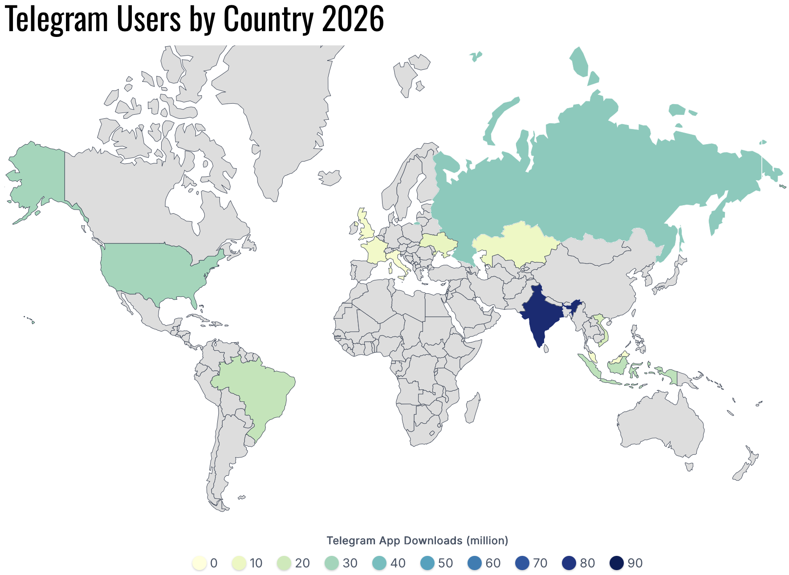
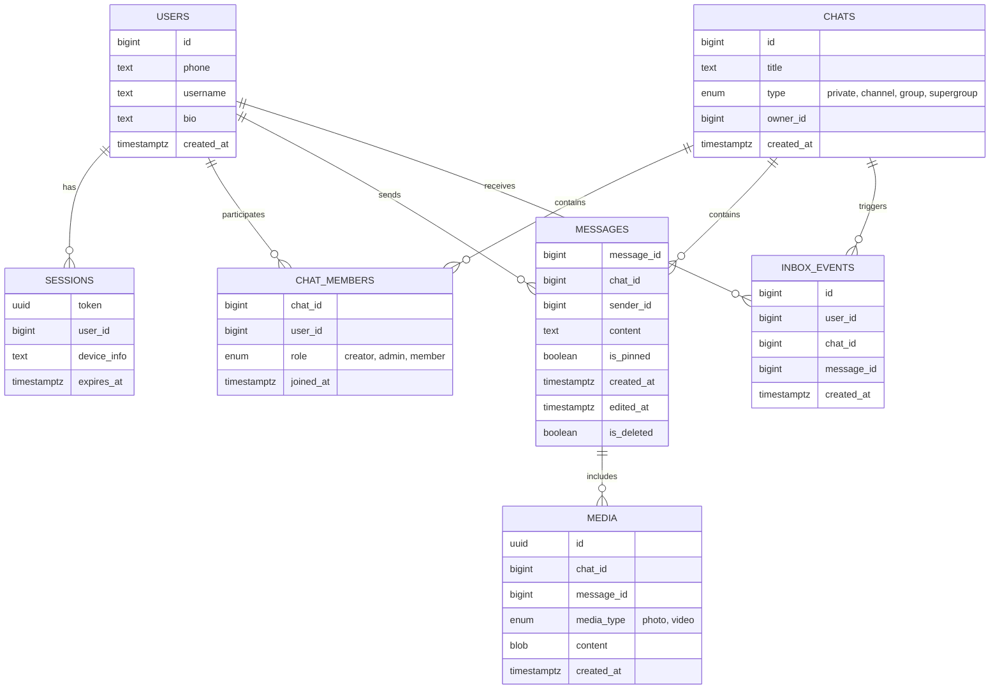
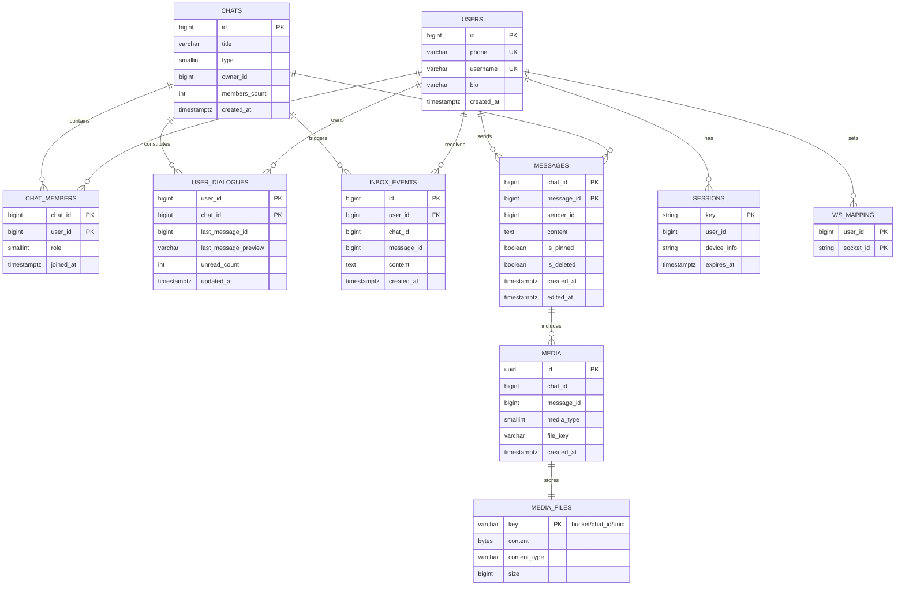
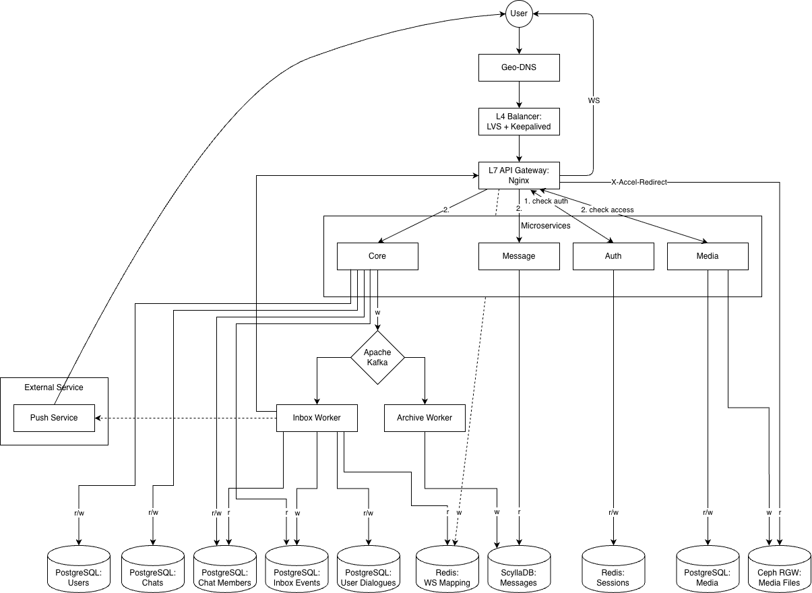

# Проектирование высоконагруженных систем. Telegram

# 1. Тема, целевая аудитория и функционал

## 1.1 Тема и целевая аудитория

**Telegram** — мессенджер для мгновенного обмена сообщениями с поддержкой личных и групповых чатов. Сервис ориентирован на скорость, безопасность и конфиденциальность при передаче сообщений между пользователями.

**Monthly Active Users**: ~1 млрд [1]. 

**Daily Active Users**: ~450 млн [1].

**Дополнительная информация**: в среднем пользователь открывает Telegram 21 раз в день и проводит в приложении 41 минуту [2].

**Демография**: 56.8% пользователей Telegram - мужчины, 43.2% - женщины. 53.5% пользователей имеют возраст от 18 до 34 лет [3].

**География**: Глобальный рынок [4].

Топ 5 стран, где больше всего используют Telegram:

| Страна | Количество пользователей, млн |
|--------|-------------------------------|
| Индия | 83.85 |
| Россия | 35.06 |
| США | 29.92 |
| Индонезия | 24.34 |
| Бразилия | 22.83 |

## 1.2 Функционал MVP

Основной функционал заключается в обеспечении обмена сообщениями между пользователями.

1. Отправка сообщений;
2. Чтение сообщений в чатах;
3. Список чатов;
4. Cоздание групп и участие в них;
5. Cоздание каналов и чтение постов;
6. Отправка и получение медиаконтента (фото, видео).

## 1.3 Ключевые продуктовые решения

1. **Облачное хранение сообщений** позволяет синхронизировать историю переписки между всеми устройствами пользователя и восстанавливать историю при переустановке приложения.
2. **Синхронизация состояния** чатов и сообщений между всеми активными сессиями пользователя на разных устройствах.
3. **MTProto протокол** — собственный протокол передачи данных, оптимизированный для мобильных сетей с высокой эффективностью использования трафика и низкой задержкой.

# 2. Расчёт нагрузки

## 2.1 Продуктовые метрики

Для расчетов используются показатели аудитории из п.1, а также статистические данные об активности пользователей из открытых источников.

### Сводная таблица продуктовых метрик

| Метрика | Значение | Источник |
| :--- | :--- | :--- |
| **Monthly Active Users (MAU)** | 1 млрд | [1] |
| **Daily Active Users (DAU)** | 450 млн | [1] |
| **Среднее кол-во сообщений (отправка)** | 30 в день | [5] |
| **Среднее кол-во сообщений (чтение)** | 100 в день | [6] |
| **Средний размер сообщения (текст)** | 100 байт | см. обоснование метрик |
| **Средний размер фото** | 200 Кбайт | см. обоснование метрик |
| **Средний размер видео** | 10 Мбайт | см. обоснование метрик |
| **Среднее количество сессий (открытий)** | 21 раз в день | [2] |
| **Срок хранения истории** | Бессрочно (расчет на 1 год) | [1] |

### Обоснование метрик
* **Текст (100 байт):** Средний размер сообщения с учетом метаданных протокола MTProto и основного тела объекта `Message`.
* **Фото (200 Кбайт):** Оптимальный размер изображения для приложений.
* **Видео (10 Мбайт):** Средний размер видеосообщения (кружочка, небольшого видео) при битрейте ~2,5 Мбит/с.

## 2.2 Технические метрики

### Расчёт объёма хранения
Расчёт производится для хранения данных, генерируемых за **1 год** использования сервиса.

| Тип данных | Формула расчёта для 1 пользователя | Общий объём данных |
| :--- | :--- | :--- |
| **Текстовые сообщения** | 30 сообщ. × 365 д. × 100 байт ≈ 1,1 Мбайт | **495 Тбайт** |
| **Фото** | 10 ед. × 365 д. × 200 Кбайт ≈ 0,73 Гбайт | **329 Пбайт** |
| **Видео** | 1 ед. × 365 д. × 10 Мбайт ≈ 3,65 Гбайт | **1,64 Эбайт** |
| **Итого** | **~4,4 Гбайт** | **~2 Эбайт** |

### Сетевой трафик
При расчёте используется коэффициент суточной неравномерности *k* = 2 для определения пиковой нагрузки.

| Тип трафика | Суточный объём (Тбайт/сут) | Средний трафик (Гбит/с) | Пиковый трафик (*k*=2) (Гбит/с) |
| :--- | :--- | :--- | :--- |
| **Текстовые данные** | 450 млн × 130 зап. × 100 байт ≈ 5,8 | 0,55 | 1,1 |
| **Фото** | 450 млн × 10 ед. × 200 Кбайт ≈ 900 | 85 | 170 |
| **Видео** | 450 млн × 1 ед. × 10 МБ ≈ 4 500 | 427 | 853 |
| **Итого** | **~5 406** | **~513** | **~1024** |

### Расчёт RPS (Requests Per Second)
RPS рассчитывается по формуле: **RPS = (DAU × Действия в сутки) / 86 400**.

| Тип запроса | Общее кол-во запросов в сутки | Средний RPS | Пиковый RPS (*k*=2) |
| :--- | :--- | :--- | :--- |
| **Отправка сообщений** | 450 млн × 30 сообщ. = 13,5 млрд | 156 250 | 312 500 |
| **Синхронизация** | 450 млн × 21 сессия = 9,45 млрд | 109 375 | 218 750 |
| **Загрузка медиа** | 450 млн × (10 фото + 1 видео) = 4,95 млрд | 57 292 | 114 584 |
| **Итого** | **27,9 млрд** | **~322 917** | **~645 834** |

# 3. Глобальная балансировка нагрузки

## 3.1 Функциональное разбиение по доменам

Для оптимизации обработки разнородных запросов и независимого масштабирования сервисов используются следующие домены:

| Доменное имя | Назначение |
| --- | --- |
| **`api.telegram.org`** | Основное API (обмен сообщениями, синхронизация) |
| **`media.telegram.org`** | Передача "тяжёлого" контента (фото, видео) |
| **`static.telegram.org`** | Раздача статических ресурсов |

## 3.2 Расположение дата-центров

| ID | Локация [8] | Обслуживаемый регион |
| --- | --- | --- |
| **DC1, DC3** | **Майами (США)** | Северная и Южная Америка |
| **DC2, DC4** | **Амстердам (Нидерланды)** | Европа, Африка |
| **DC5** | **Сингапур (Сингапур)** | Азия и Океания |

**Обоснование выбора:**

* **Амстердам:** крупнейшая точка обмена трафиком. Обеспечивает кратчайший путь до пользователей из РФ и Европы.
* **Сингапур:** ключевой узел в Азиатско-Тихоокеанском регионе. Исключает задержки при передаче данных через океан для пользователей из Индии.
* **Майами:** оптимальная точка входа в Северную и Южную Америку.

**Логика размещения данных:**

* **Каждый из 5 дата-центров** имеет свою базу данных для хранения данных тех пользователей, которые к нему привязаны.
* **Личные сообщения** хранятся в «родном» ДЦ каждого участника диалога. Синхронизация между регионами происходит через внутреннее межсерверное взаимодействие.
* **Группы и каналы** привязываются к одному ДЦ («родной» ДЦ создателя) для обеспечения строгой последовательности сообщений для всех участников.

## 3.3 Распределение запросов по ДЦ

Нагрузка распределяется пропорционально активной аудитории регионов, исходя из рассчитанного пикового RPS **645 834** (п. 2.2).

| Регион (ДЦ) | Процент трафика | Пиковый RPS | Обоснование |
| --- | --- | --- | --- |
| **Азия (DC5)** | 40% | ~258 334 | Крупнейший регион (Индия) |
| **Европа (DC2, DC4)** | 35% | ~226 042 | РФ, СНГ и Европа |
| **Америка (DC1, DC3)** | 25% | ~161 459 | США и Бразилия |
| **Итого** | **100%** | **645 834** |  |

## 3.4 Схема балансировки

Для минимизации задержек при перемещении пользователей используется двухуровневая схема балансировки.

**1 уровень (Geo-based DNS)**

| Домен | Что отправляется/запрашивается | Куда направляется |
| --- | --- | --- |
| **`api.telegram.org`** | Запросы API: отправка/получение сообщений, синхронизация, список чатов | IP одного из 5 DC по геолокации (Азия - DC5, Европа/РФ - DC2/DC4, Америки - DC1/DC3) |
| **`media.telegram.org`** | Загрузка и скачивание фото, видео | IP одного из 5 DC по геолокации (Азия - DC5, Европа/РФ - DC2/DC4, Америки - DC1/DC3) |
| **`static.telegram.org`** | Запросы статики (JS, CSS) | IP одного из 5 DC по геолокации (Азия - DC5, Европа/РФ - DC2/DC4, Америки - DC1/DC3) |

**2 уровень (внутреннее проксирование)**

При нахождении пользователя вне «родного» региона (командировка, туризм) используется трехуровневый алгоритм обработки запроса:

* **Идентификация:** ближайший к пользователю ДЦ принимает соединение и определяет User_ID.
* **Поиск:** по локальной реплике реестра пользователей определяется ID «родного» ДЦ пользователя, где физически хранятся его данные.
* **Туннелирование:** запрос проксируется в целевой ДЦ по внутренним магистральным каналам Telegram.

**Примечание:** если пользователь находится в «чужом» регионе длительное время, система инициирует фоновый перенос данных из старого ДЦ в новый ближайший ДЦ (**User Migration**).

## 3.5 Механизмы регулировки трафика

1. **Weighted Round-Robin:** использование весовых коэффициентов для управления долями входящего трафика (для DC1 и DC3, для DC2 и DC4).
2. **Active Health Checks:** мониторинг состояния ДЦ. При деградации сервиса ДЦ автоматически выводится из DNS-выдачи.

# 4. Локальная балансировка нагрузки

## 4.1 Схема балансировки

Внутри дата-центра реализована двухуровневая схема балансировки:

**L4-балансировщик:**

| Параметр | Описание |
| --- | --- |
| **Реализация** | LVS (Linux Virtual Server) |
| **Режим работы** | Virtual Server via Direct Routing. Входящий трафик распределяется между узлами L7, а исходящий трафик идёт напрямую к клиенту, что минимизирует нагрузку на балансировщик. |
| **Резервирование** | Схема N × 2. Keepalived обеспечивает автоматическое переключение Virtual IP на резервный узел при отказе основного. |

**L7-балансировщик:**

| Параметр | Описание |
| --- | --- |
| **Реализация** | Кластер серверов nginx (Reverse Proxy) |
| **Функции** | SSL Termination, распределение запросов по микросервисам |
| **Оптимизация** | Session tickets для ускорения повторных TLS-соединений |
| **Резервирование** | Схема N + 1 |

## 4.2 Расчёт количества балансировщиков

Расчёт выполнен для наиболее загруженного дата-центра (DC5 — Азия) в «худшем» случае:

* **Пиковый трафик:** 410 Гбит/с  
* **Пиковая нагрузка:** 258 334 RPS  

### 1. Расчёт узлов L4

Целевая конфигурация — серверы с сетевыми интерфейсами 100GbE. Ограничитель — пропускная способность канала.

**Расчёт активных узлов:**

410 Гбит/с ÷ 100 Гбит/с = 4,1 → 5 серверов

С учётом резервирования (N × 2): на каждую активную ноду нужен резерв.

**Итого:** 10 серверов.

### 2. Расчёт узлов L7

Конфигурация узлов: 16 CPU, NIC 100GbE. Учитываются два ограничителя: пропускная способность и SSL Termination.

**По пропускной способности:**

410 Гбит/с ÷ 100 Гбит/с = 4,1 → 5 серверов

**По SSL Termination:**

Интенсивность новых TLS-соединений принята равной общему RPS:

258 334 RPS = 258 334 CPS

При производительности одного сервера 6 676 CPS [9]:

258 334 CPS ÷ 6 676 CPS ≈ 38,7 → 39 серверов

39 > 5, выбираем «худший» случай — 39. С учётом резервирования (N + 1) — 40 серверов.

**Итого:** 40 серверов. 

## 4.3 Итоговая конфигурация оборудования

| Уровень | Количество | Конфигурация узла | Тип резервирования |
| --- | --- | --- | --- |
| **L4** | 10 | CPU 8 Cores, NIC 100GbE | N × 2 |
| **L7** | 40 | CPU 16 Cores, NIC 100GbE | N + 1 |

# 5. Логическая схема БД

## 5.1 Схема БД

## 5.2 Таблица с описанием таблиц

| Таблица | Описание | Размер строки | Количество строк | Размер таблицы | Нагрузка на запись (QPS, пик) | Нагрузка на чтение (QPS, пик) |
| :--- | :--- | :--- | :--- | :--- | :--- | :--- |
| **`users`** | Профили пользователей | id(8) + phone(20) + username(32) + bio(70) + created_at(8) ≈ 138 Б | 2,7 млрд | 373 ГБ | 58 | 175 000 |
| **`sessions`** | Сессии пользователей | token(16) + user_id(8) + device_info(50) + expires_at(8) ≈ 82 Б | 5,4 млрд | 443 ГБ | 8 646 | 209 374 |
| **`chats`** | Чаты (диалоги, группы, каналы) | id(8) + title(50) + type(1) + owner_id(8) + created_at(8) ≈ 75 Б | 13,5 млрд | 1,01 ТБ | 15 625 | 175 000 |
| **`chat_members`** | Участники чатов | chat_id(8) + user_id(8) + role(1) + joined_at(8) ≈ 25 Б | 135 млрд | 3,38 ТБ | 156 250 | 468 750 |
| **`messages`** | Сообщения | message_id(8) + chat_id(8) + sender_id(8) + content(100) + is_pinned(1) + created_at(8) + edited_at(8) + is_deleted(1) ≈ 142 Б | 63,6 трлн | 9,0 ПБ | 312 500 | 1 041 666 |
| **`media`** | Медиафайлы | id(16) + chat_id(8) + message_id(8) + media_type(1) + content(200 КБ) + created_at(8) ≈ 201 КБ | 6,36 трлн | ≈ 1,3 ЭБ | 114 584 | 143 228 |
| **`inbox_events`** | Лента событий пользователя (дельта) | id(8) + user_id(8) + chat_id(8) + message_id(8) + created_at(8) ≈ 40 Б | ~200 млрд | 8,2 ТБ | 312 500 | 218 750 |

Требования к консистентности:

* Strict Consistency: `users`, `sessions`, `chats`, `chat_members`, `messages`, `inbox_events`.
* Eventual Consistency: `media` (допустима небольшая задержка при загрузке медиафайлов).

# 6. Физическая схема БД

Денормализация:

1. Для оптимизации загрузки главного экрана (списка чатов) введена таблица `user_dialogues`. Она хранит для каждого пользователя в каждом чате: идентификатор последнего сообщения (`last_message_id`), текстовый превью (`last_message_preview`), счётчик непрочитанных (`unread_count`) и время обновления (`updated_at`) для сортировки. Благодаря этому формирование списка чатов выполняется одним запросом без JOIN с `messages`.
2. Введена таблица `inbox_events` — персональная лента событий (дельта) для каждого пользователя. Шардируется по `user_id`. Клиент при синхронизации вычитывает только новые записи из этой таблицы, что минимизирует трафик.
3. В `chats` хранится `members_count` для отображения числа участников без агрегата по `chat_members` при каждом открытии списка.
4. Содержимое файлов вынесено из таблицы `media` в объектное хранилище; в PostgreSQL остаётся ключ `file_key`.

## 6.1 Выбор СУБД

| Таблица | СУБД / хранилище | Обоснование |
| :--- | :--- | :--- |
| `users`, `chats`, `chat_members`, `user_dialogues`, `inbox_events` | **PostgreSQL** | ACID-транзакции, строгая консистентность. |
| `messages` | **ScyllaDB** | Высокие RPS записи/чтения, партиционирование по `chat_id` |
| `sessions` | **Redis** | Низкая задержка, TTL для сессий |
| `ws_mapping` | **Redis** | Множество активных WebSocket-соединений пользователя |
| `media` | **PostgreSQL** | Метаданные медиафайлов (тип, ключ в S3, привязка к сообщению) |
| `media_files` | **Ceph RGW** | Хранение содержимого файлов (фото, видео) в объектном хранилище |

Итого:

* **PostgreSQL:** `users`, `chats`, `chat_members`, `user_dialogues`, `inbox_events`, `media`.
* **ScyllaDB:** `messages` (первичный ключ составной: partition `chat_id`, clustering `message_id` DESC).
* **Redis:** ключи вида `session:{token}`, множества `user_sessions:{user_id}`; множества `ws:{user_id}`.
* **Ceph RGW:** `media_files` — объекты по ключу из `media.file_key`.

## 6.2 Индексы

| Таблица | Поле | Тип индекса | Обоснование |
| :--- | :--- | :--- | :--- |
| `users` | `id` | B-Tree | Поиск профиля по ID |
| `users` | `phone` | Hash | Поиск при авторизации |
| `users` | `username` | B-Tree | Поиск по никнейму |
| `chats` | `id` | B-Tree | Доступ к метаданным чата |
| `chats` | `owner_id` | B-Tree | Поиск чатов, созданных пользователем |
| `chat_members` | `(chat_id, user_id)` | Composite (B-Tree) | Уникальность членства, проверка прав |
| `user_dialogues` | `(user_id, chat_id)` | Composite (B-Tree) | Список чатов пользователя |
| `user_dialogues` | `(user_id, updated_at DESC)` | Composite (B-Tree) | Сортировка чатов по времени последнего обновления |
| `media` | `id` | B-Tree | Точечный доступ к метаданным медиа |
| `media` | `(chat_id, message_id)` | Composite (B-Tree) | Связка медиа с сообщением |
| `inbox_events` | `(user_id, id)` | Composite (B-Tree) | Выборка дельты: `WHERE user_id = ? AND id > ?` |
| `inbox_events` | `(user_id, message_id)` | Unique Composite (B-Tree) | Дедупликация при повторной обработке из Kafka |
| `messages` | `(chat_id, message_id)` | Partition Key `chat_id` + Clustering Key `message_id` DESC | Для чтения истории чата |
| `sessions` | `token` | Redis Key | Проверка авторизации |
| `sessions` | `user_id` | Redis Set (`user_sessions:{id}`) | Поиск активных сессий пользователя |
| `ws_mapping` | `user_id` | Redis Set (`ws:{user_id}`) | Множество активных сокетов пользователя |

## 6.3 Шардирование и резервирование СУБД

**Шардирование**

| Таблица | СУБД | Ключ шардирования | Обоснование |
| :--- | :--- | :--- | :--- |
| `users` | PostgreSQL | `id` | Равномерное распределение нагрузки |
| `sessions` | Redis | `token` | Равномерное распределение нагрузки |
| `ws_mapping` | Redis | `user_id` | Все сокеты пользователя на одном узле |
| `chats`, `chat_members`, `media` | PostgreSQL | `chat_id` | Все метаданные чата на одном узле |
| `user_dialogues`, `inbox_events` | PostgreSQL | `user_id` | Список чатов и лента событий пользователя на одном шарде |
| `messages` | ScyllaDB | `chat_id` (Partition Key) | История переписки чата на одном узле |

**Резервирование**

| СУБД | Схема | Обоснование |
| :--- | :--- | :--- |
| PostgreSQL | Master–Replica (1 мастер, 2 реплики). Запись на мастер, чтение с реплик. Автоматический failover через Patroni | Исключение единой точки отказа, распределение нагрузки чтения |
| ScyllaDB | Каждая партиция хранится на 3 узлах (Replication Factor = 3). Консистенция QUORUM | Автоматическое переключение при отказе узла, сохранение данных |
| Redis | Redis Cluster (мастер + реплика на каждый слот). Автоматический failover | Отказоустойчивость, сохранение сессий и WebSocket-маппинга |
| S3 | Георепликация между регионами | Защита от отказа целого дата-центра |

# 7. Алгоритмы

**Transactional Inbox** с использованием распределённой очереди сообщений (Kafka) и персональных лент событий в шардированном PostgreSQL.

**Этап 1: Публикация события в Kafka**

**Этап 2: Потребление из Kafka (два независимых консьюмера)**

* **Archive Worker** — записывает тело сообщения в ScyllaDB (партиция `chat_id`, кластерный ключ `message_id`). Идемпотентность обеспечивается по `message_id` (повторная запись перезаписывает данные).
* **Inbox Worker** — раскладывает события по персональным лентам получателей (см. ниже).

**Этап 3: Fan-out через Inbox Worker**

1. **Приём события**
2. **Определение получателей**
3. **Маршрутизация по шардам:** события группируются по `user_id` получателя, чтобы каждый воркер писал только в один шард PostgreSQL (для снижения числа соединений).
4. Проверка таблицы `inbox_events` на наличие текущего `message_id` для данного `user_id`. Если запись существует, шаг пропускается (идемпотентность). **Добавление записи в `inbox_events`**.

**Этап 4: Real-time нотификация**

1. Сервер проверяет Redis Set `ws:{user_id}`: если множество непустое (есть активные WebSocket-соединения), сервер извлекает данные из только что записанного Inbox и отправляет их во все сокеты пользователя.
2. Если сокет закрыт — инициируется отправка Push-уведомления, содержащего только `chat_id` (без текста — в целях приватности). Push служит сигналом «есть новая дельта».

**Этап 5: Запрос клиента (подкачка дельты)**

1. Клиент отправляет запрос `GET /sync?since_id={last_known_id}`.
2. Сервер выбирает из `inbox_events` все строки с `id > since_id` для данного `user_id` и возвращает клиенту дельту.
3. Клиент обновляет `last_known_id` до максимального `id` из ответа.

# 8. Технологии

| Технология | Область применения | Мотивационная часть |
| :--- | :--- | :--- |
| **TypeScript + React** | Веб-клиент (Frontend) | Статическая типизация TypeScript снижает количество ошибок в коде, а компонентная модель React с виртуальным DOM эффективно обновляет список чатов и историю переписки без перерисовки всего интерфейса |
| **Kotlin** | Мобильный клиент (Android) | Нативная разработка под Android |
| **Swift** | Мобильный клиент (iOS) | Нативная разработка под iOS |
| **Go** | Backend (бизнес-логика) | Высокая производительность и эффективная работа с конкурентностью (горутины) при обработке множества WebSocket-соединений |
| **Nginx** | L7-балансировка, SSL Termination | Стандарт индустрии для реверс-проксирования и распределения запросов по микросервисам, а также поддержка Session Tickets для ускорения повторных TLS-соединений мобильных клиентов |
| **PostgreSQL** | Основная реляционная БД | ACID-транзакции и строгая консистентность |
| **ScyllaDB** | Хранилище истории сообщений | NoSQL-решение с LSM-деревом, способное выдерживать пиковую нагрузку записи/чтения при хранении триллионов строк |
| **Redis** | Сессии, WebSocket-маппинг | In-memory хранилище для быстрого доступа к сессиям и множеству активных WebSocket-соединений пользователя, TTL для автоматического истечения сессий |
| **Apache Kafka** | Брокер сообщений | Гарантия доставки событий и сохранение порядка сообщений внутри чата через partition key |
| **Kubernetes** | Оркестрация сервисов | Автоматизация деплоя и масштабирования |
| **Ceph RGW** | Хранилище медиа | Распределённое объектное хранилище с S3-совместимым API (RGW) для хранения фото и видео |

# 9. Схема проекта

Пояснения к схеме:
* r - read, w - write
* Для эндпоинтов /login и /register в Nginx настроены исключения. Запросы на эти эндпоинты проксируются напрямую без предварительной проверки сессии, т.е., например, после успешной регистрации данные сохраняются в PostgreSQL, а в Redis создается активная сессия.

# 10. Обеспечение надёжности

| Компонент системы | Метод обеспечения надёжности |
| :--- | :--- |
| **LVS** | Резервирование Active-Passive (использование Keepalived). |
| **Nginx** | Резервирование Active-Active. Горизонтальное масштабирование узлов L7-балансировки для распределения нагрузки. |
| **PostgreSQL** | Master-Slave репликация. Архивация WAL-логов для восстановления данных на любой момент времени. |
| **ScyllaDB** | Распределённая архитектура с фактором репликации RF = 3. Автоматическое перераспределение данных при выходе из строя одного из узлов. |
| **Redis** | Redis Cluster: для каждого слота — мастер и реплика; автоматический failover при отказе мастера слота. |
| **Apache Kafka** | Использование механизма подтверждений и хранения смещений. Если воркер упадет в процессе записи в базу, после перезапуска он продолжит чтение из Kafka ровно с того места, где остановился. |
| **Ceph RGW** | Распределенное хранение данных с использованием Erasure Coding (позволяет восстановить данные без необходимости дублирования полного объема данных). |
| **Микросервисы** | Автоматический перезапуск упавших контейнеров посредством Kubernetes. |

**Graceful Shutdown:** при обновлении системы воркеры и сервисы прекращают брать новые задачи, завершают обработку текущего батча данных и только после этого завершают процесс.

**Graceful Degradation:** архитектура спроектирована с учетом частичных отказов. Например, при сбое в Media Service или хранилище Ceph RGW пользователи временно теряют возможность обмениваться медиа, но сохраняют возможность текстовой переписки.

# 11. Расчет ресурсов

Все сервисы развёртываются в 5 дата-центрах (DC1–DC5). Stateless-сервисы (Go-микросервисы) работают в Kubernetes; stateful-компоненты (БД) — на выделенных физических серверах (Bare Metal).

Расчёты выполнены для **DC5 (Азия)** — крупнейшего ДЦ с долей **40% трафика** и пиковой нагрузкой **258 334 RPS**.

## 11.1 Ресурсные требования

Количество ядер CPU для микросервисов рассчитывается по формуле:

Количество ядер CPU = Пиковый RPS / Норма нагрузки на 1 ядро

### Нормы производительности
| Характер нагрузки | Норма (RPS на 1 ядро) |
| :--- | :--- |
| **Auth API** (JWT, Redis) | 8 000 |
| **Core API** (Бизнес-логика, PG) | 3 000 |
| **Message API** (Архив сообщений, Scylla) | 6 000 |
| **Media API** (S3 Proxy) | 4 000 |

### Сводная таблица ресурсов
| Сервис | Нагрузка (RPS) | Расчет | CPU (ядер) | RAM |
| :--- | :--- | :--- | :--- | :--- |
| **auth-service** | 258 334 | 258 334 / 8 000 | 32 | 32 ГБ |
| **core-service** | 43 750 | 43 750 / 3 000 | 16 | 32 ГБ |
| **message-service** | 125 000 | 125 000 / 6 000 | 24 | 24 ГБ |
| **media-service** | 114 584 | 114 584 / 4 000 | 32 | 32 ГБ |
| **Итого** | | | **104** | **120 ГБ** |

## 11.2 Конфигурации и стоимость (CAPEX/OPEX)

Цены взяты из актуальных прайс-листов провайдеров (Selectel / Hetzner Bare Metal).
Формула стоимости:
Итоговая стоимость = Количество серверов * Цена за единицу

| Тип сервера | Конфигурация (Пример: Selectel Chipcore) | Кол-во | Цена (закупка) | Итого (CAPEX) | Аренда (мес) |
| :--- | :--- | :--- | :--- | :--- | :--- |
| **kubenode** | 2×EPYC 7543 (64c), 512GB RAM | 32 | $18 000 | $576 000 | $300 |
| **lvs-l4** | Xeon E-2334 (4c), 100GbE NIC | 32 | $4 000 | $128 000 | $67 |
| **nginx-l7** | Xeon Silver (16c), 100GbE NIC | 108 | $5 500 | $594 000 | $92 |
| **db-postgres** | EPYC 7282 (16c), 256GB, NVMe | 30 | $12 000 | $360 000 | $220 |
| **db-scylla** | EPYC 7282 (16c), 256GB, 4xNVMe | 18 | $15 000 | $270 000 | $310 |
| **db-redis** | Xeon 4210R (10c), 512GB RAM | 30 | $11 000 | $330 000 | $180 |
| **ceph-osd** | Xeon E-2334, 12x18TB HDD | 55 | $18 000 | $990 000 | $300 |
| **Итого** | | **305** | | **$3 248 000** | **$55 230** |

**Источник цен:** [Selectel Dedicated Servers Configurator](https://selectel.ru/services/dedicated/) / [Hetzner PX line](https://www.hetzner.com/dedicated-rootserver).

## 11.3 Аллокация в Kubernetes (DC5)

| Сервис | Реплики | CPU Request | RAM Request | Назначение |
| :--- | :--- | :--- | :--- | :--- |
| **auth-service** | 4 | 8 | 8 ГБ | Авторизация и сессии |
| **core-service** | 2 | 8 | 16 ГБ | Основная бизнес-логика |
| **message-service** | 3 | 8 | 8 ГБ | Доступ к архиву сообщений |
| **media-service** | 4 | 8 | 8 ГБ | Проксирование в Ceph |

Примечание: CPU limits равны CPU requests — throttling недопустим для Telegram. RAM limits удвоены относительно RAM requests как защита от аномальных всплесков без риска OOM при штатных пиках. 

Для всех Go-сервисов устанавливается переменная окружения `GOMEMLIMIT` на уровне 90% от RAM limit контейнера. Без этого GC Go не осведомлён о границах памяти контейнера и позволяет heap расти до жёсткого лимита, после чего OOM killer ядра убивает под раньше, чем сборщик мусора успевает освободить память. `GOMEMLIMIT` сигнализирует о том, что нужно агрессивнее запускать GC при приближении к пороговому значению, предотвращая OOM.

## 11.4 Обоснование масштабирования
1. Указанные 55 серверов Ceph OSD — это стартовый объем. Закупка производится порциями по мере заполнения дисков (порог 70%).
2. Количество серверов в DC1-DC4 ниже, чем в DC5; их количество пропорционально доле трафика (п. 3.3).

## Список источников

1. https://telegram.org/press
2. https://t.me/durov/404
3. https://www.demandsage.com/telegram-statistics/
4. https://worldpopulationreview.com/country-rankings/telegram-users-by-country
5. https://telegram.org/blog/15-billion
6. https://ads.telegram.org
7. https://core.telegram.org/api/datacenter
8. https://telegramplayground.github.io/pyrogram/faq/what-are-the-ip-addresses-of-telegram-data-centers.html#id1
9. https://blog.nginx.org/blog/testing-the-performance-of-nginx-and-nginx-plus-web-servers
10. https://www.statista.com/statistics/1344149/telegram-cumulative-downloads-worldwide
11. https://resourcera.com/data/social/telegram-users/
